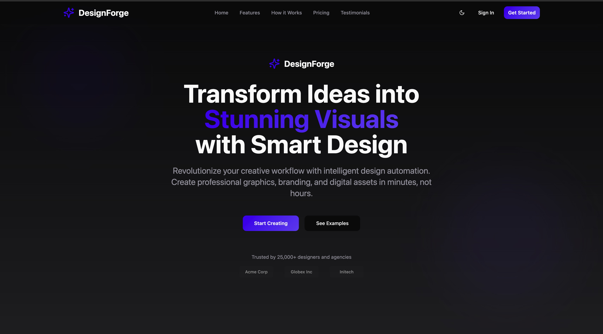
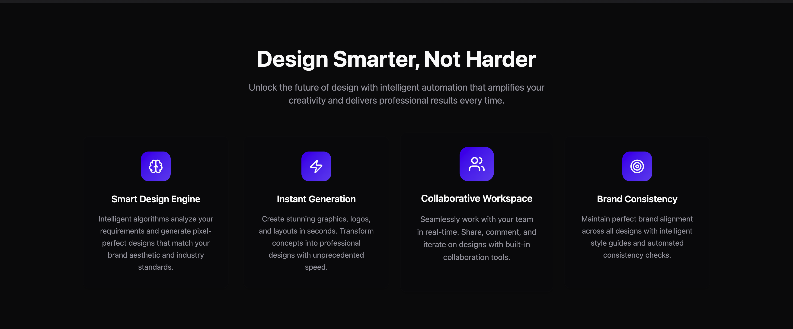
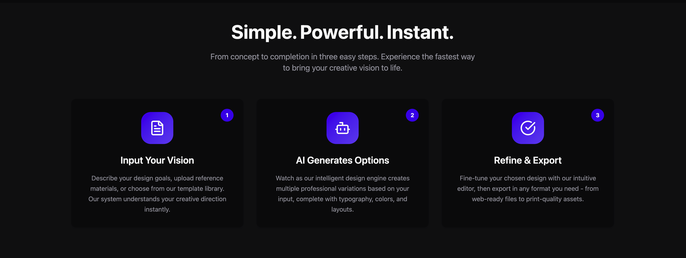
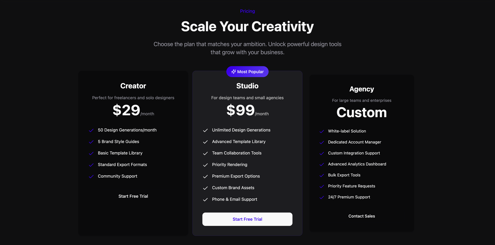
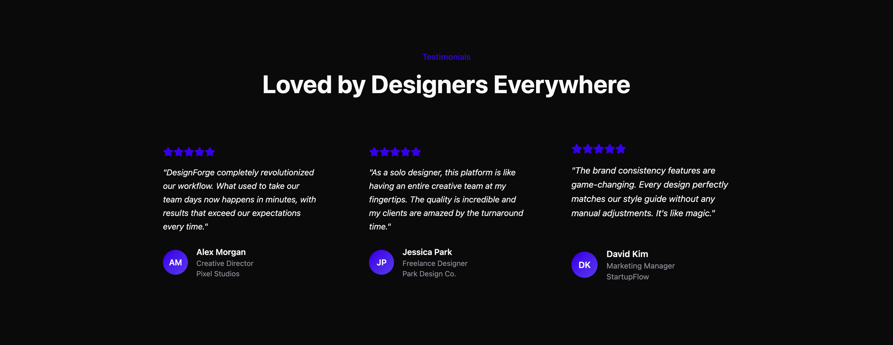
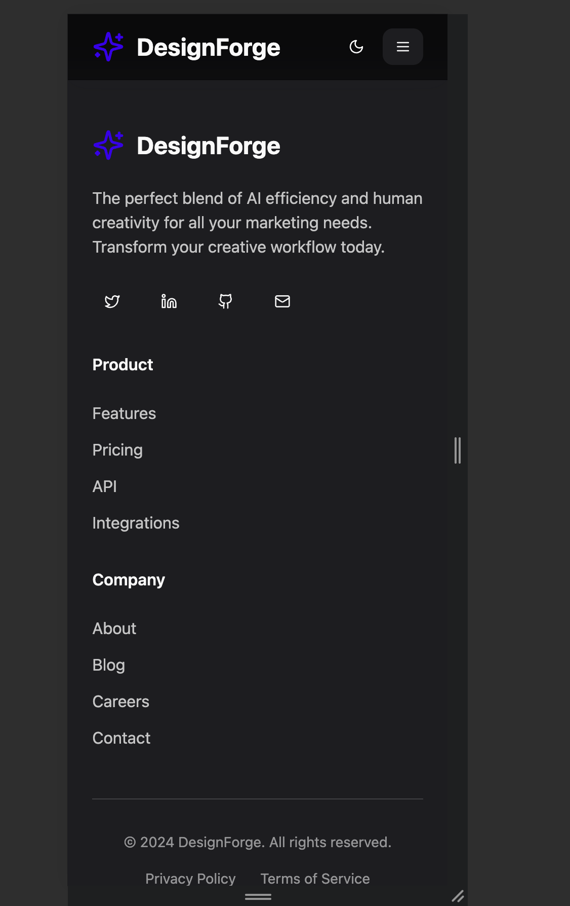
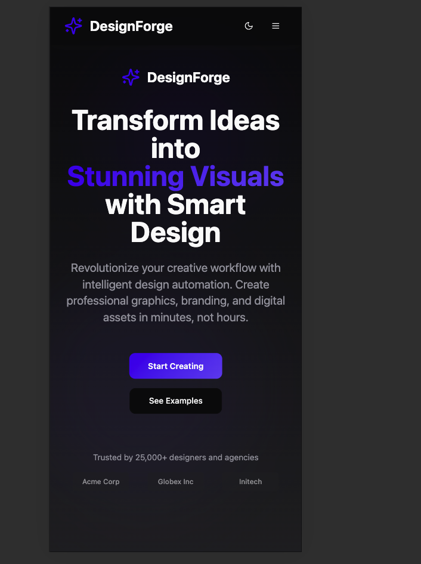
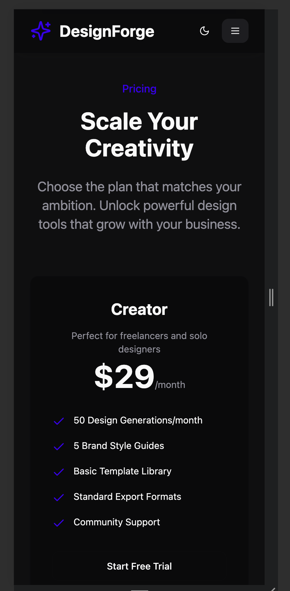
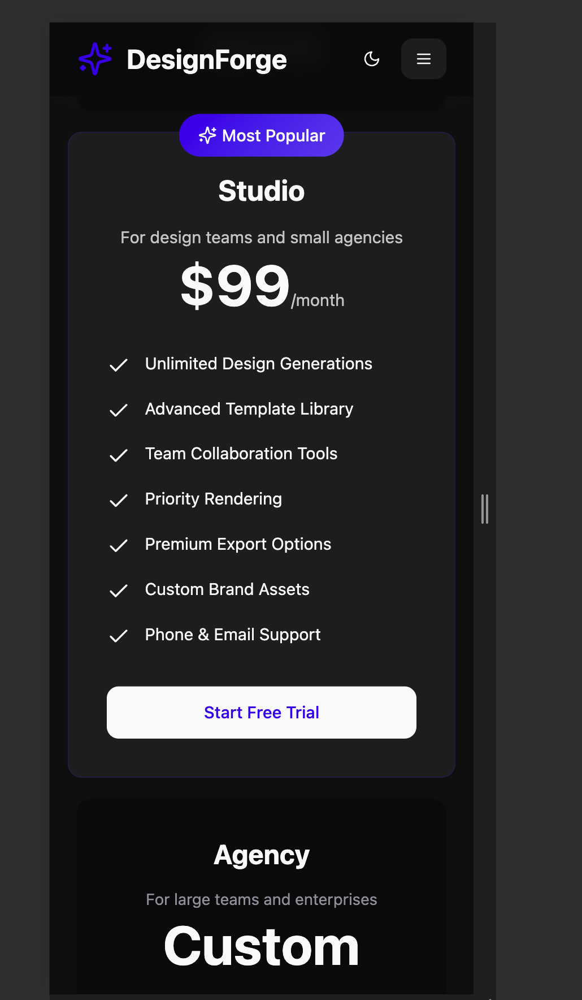
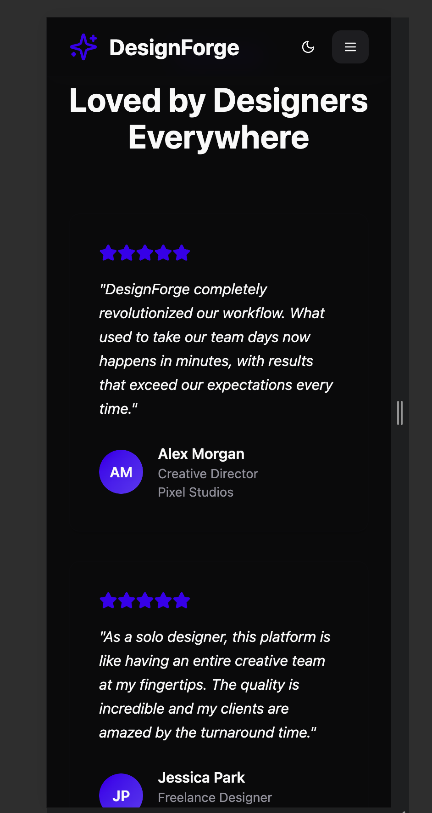

# DesignForge Platform Homepage

A modern, responsive static homepage for a creative platform, built with extensive use of AI coding tools and assistants.

## 🤖 AI Platforms Used

### Cursor
- **How it was used (in depth):**
  - **AI-Powered Code Editing:** Cursor was used as the primary development environment, providing real-time code suggestions, refactoring, and error correction as the project evolved.
  - **Iterative UI Development:** Leveraged Cursor’s AI chat and inline code tools to rapidly prototype and refine React components, Tailwind CSS layouts, and TypeScript logic.
  - **Automated Repetitive Tasks:** Used Cursor to automate repetitive changes (e.g., renaming, updating props, refactoring components) across the codebase, saving significant manual effort.
  - **Debugging and Troubleshooting:** When encountering errors or unexpected UI behavior, Cursor’s AI assistant provided targeted fixes and explanations, streamlining the debugging process.
  - **Documentation and Best Practices:** Cursor suggested best practices for accessibility, responsive design, and code organization, ensuring a high-quality, maintainable codebase.
  - **Screenshot Management & Documentation:** Cursor was used to organize, rename, and reference screenshots for both desktop and mobile views, making the documentation clear and professional.

### Lovable
- **How it was used (in depth):**
  - **Project Scaffolding:** Lovable was used to generate the initial project structure, including the setup of Vite, React, TypeScript, Tailwind CSS, and essential configuration files.
  - **UI Prototyping:** Used Lovable’s AI prompts to quickly scaffold out the main UI sections (Hero, Features, How It Works, Pricing, Testimonials, Footer) with placeholder content and layout.
  - **Component Generation:** Leveraged Lovable to generate reusable UI primitives (buttons, cards, forms) and to create boilerplate for new components as needed.
  - **Rapid Iteration:** Lovable’s conversational interface allowed for fast iteration on design and layout ideas, enabling quick pivots and refinements based on visual feedback.
  - **Integration Guidance:** Used Lovable’s AI to assist with integrating third-party libraries, setting up routing (later removed for single-page design), and configuring Tailwind for custom theming.
  - **Collaboration:** Lovable’s platform enabled seamless collaboration between AI and developer, with changes tracked and easily reverted or extended as the project evolved.

**Note:** All screenshots were renamed for clarity and documentation purposes, and are referenced in the sections below for both desktop and mobile views.

## 📸 Screenshots

### Desktop Views
- **Full Homepage:**
  
- **Hero Section:**
  
- **Features Section:**
  
- **Pricing Section:**
  
- **Testimonials Section:**
  

### Mobile Views
- **Full Mobile Homepage:**
  
- **Mobile Hero Section:**
  
- **Mobile Pricing Section:**
  
- **Mobile Testimonials Section:**
  
- **Mobile Navigation:**
  

**Note:** These screenshots are real outputs captured from the running application, demonstrating the full homepage and all major sections (hero, features, pricing, testimonials, navigation, and footer) in both desktop and mobile layouts.

## 🚀 Features
- Hero Section: Logo, headline, and clear call-to-action buttons.
- Features Section: Four distinct feature cards with icons/images.
- How It Works: 2–3 key explanations of platform benefits.
- Pricing Table: Three pricing tiers with feature lists.
- Testimonials: Customer testimonials with carousel.
- Responsive Design: Mobile-friendly and accessible UI.
- Footer: Contact and social media links.
- Smooth Scrolling Navigation: Single-page navigation with smooth scroll to sections.

## 🛠️ Tech Stack
- React (with TypeScript)
- Vite (build tool)
- Tailwind CSS (utility-first styling)
- ESLint (code quality)
- Bun & npm (package management)

## 📁 Project Structure
- `src/components/` – Main UI sections (Hero, Features, HowItWorks, Pricing, Testimonials, Footer, Navigation)
- `src/components/ui/` – Reusable UI primitives (Button, Card, Dialog, etc.)
- `src/hooks/` – Custom React hooks
- `src/lib/` – Utility functions
- `public/` – Static assets
- `screenshots/` – Screenshots of the homepage (desktop and mobile)

## 🖥️ Running the Project

1. **Install dependencies:**
   ```sh
   npm install
   # or
   bun install
   ```
2. **Run the development server:**
   ```sh
   npm run dev
   # or
   bun run dev
   ```
3. **Open your browser:**
   - By default, Vite serves the app at [http://localhost:8080](http://localhost:8080). However, your app may run on a different port depending on your configuration or if the default port is in use.
   - **Check your terminal output after running the dev server to see the exact local address.**

## 📦 Building for Production

1. **Build the project:**
   ```sh
   npm run build
   # or
   bun run build
   ```
2. **Preview the production build:**
   ```sh
   npm run preview
   # or
   bun run preview
   ```

## 📄 License

This project is for educational and demonstration purposes.
