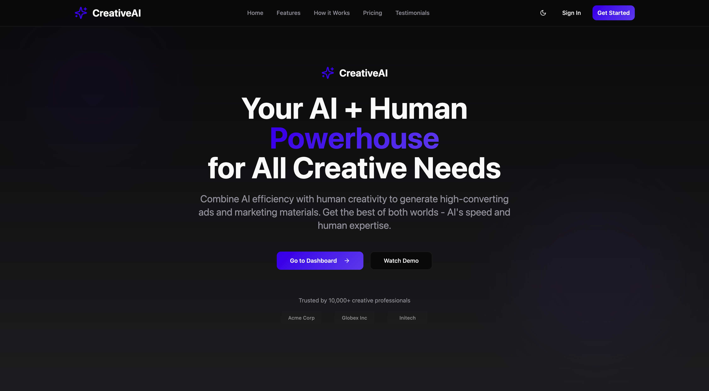
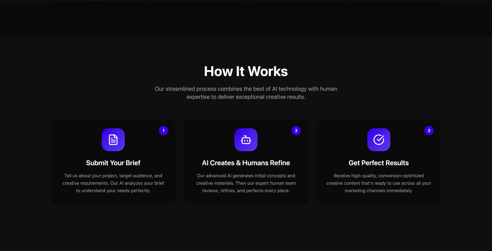
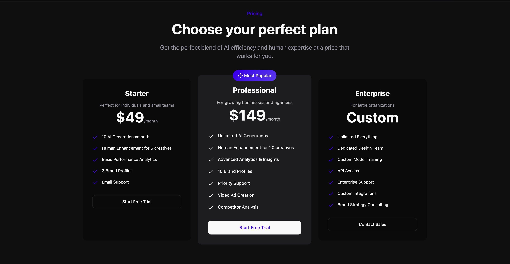
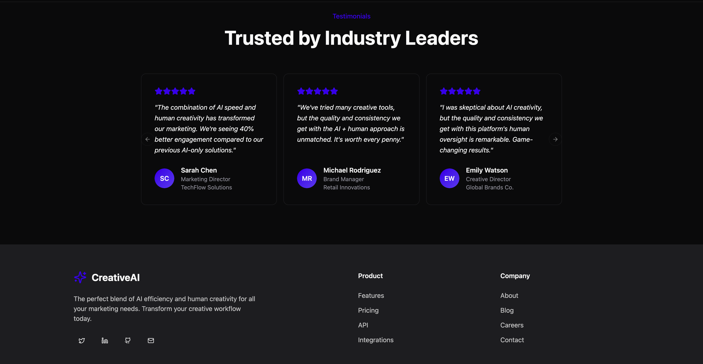
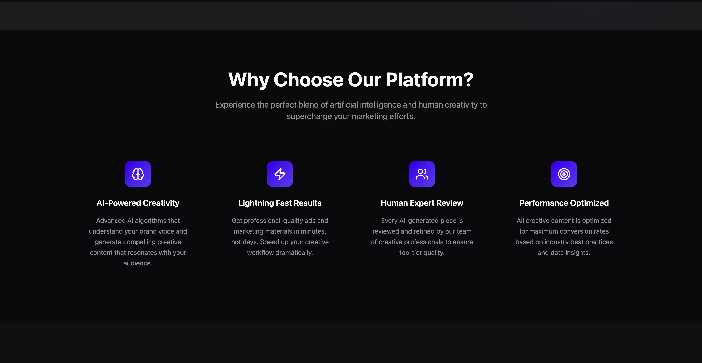

# CreativeAI Platform Homepage

A modern, responsive static homepage for a creative AI platform, built with extensive use of AI coding tools and assistants.

## 📸 Screenshots

### Desktop Views

#### Full Homepage

*Complete homepage on desktop (3420x1890)*

#### Hero Section

*Hero section with logo, headline, and call-to-action buttons*

#### Features Section

*Features section with 4 distinct feature cards and icons*

#### Pricing Section

*Pricing table with three tiers and feature lists*

### Mobile View

*Homepage on mobile device (3420x1772)*

**Note:** These are real screenshots captured from the running application at `http://localhost:8080`. The screenshots demonstrate the responsive design and all required sections of the CreativeAI Platform Homepage.

---

## �� Features

- **Hero Section:** Logo, headline, and clear call-to-action buttons.
- **Features Section:** Four distinct feature cards with icons/images.
- **How It Works:** 2–3 key explanations of platform benefits.
- **Pricing Table:** Three pricing tiers with feature lists.
- **Testimonials:** Customer testimonials with carousel.
- **Responsive Design:** Mobile-friendly and accessible UI.
- **Footer:** Contact and social media links.
- **Smooth Scrolling Navigation:** Single-page navigation with smooth scroll to sections.

## 🛠️ Tech Stack

- **React** (with TypeScript)
- **Vite** (build tool)
- **Tailwind CSS** (utility-first styling)
- **ESLint** (code quality)
- **Bun & npm** (package management)

## 🤖 AI-Assisted Development

This project was developed using AI code generation tools and assistants, ensuring rapid prototyping, best practices, and high code quality throughout the process.

## 📁 Project Structure

- `src/components/` – Main UI sections (Hero, Features, HowItWorks, Pricing, Testimonials, Footer, Navigation)
- `src/components/ui/` – Reusable UI primitives (Button, Card, Dialog, etc.)
- `src/hooks/` – Custom React hooks
- `src/lib/` – Utility functions
- `public/` – Static assets

## 🖥️ Getting Started

1. **Install dependencies:**
   ```sh
   npm install
   # or
   bun install
   ```
2. **Run the development server:**
   ```sh
   npm run dev
   # or
   bun run dev
   ```
3. **Open your browser:**
   - By default, Vite serves the app at [http://localhost:8080](http://localhost:8080). However, your app may run on a different port depending on your configuration or if the default port is in use.
   - **Check your terminal output after running the dev server to see the exact local address.**

### Changing the Development Port

If you want to use a specific port (like 8080), update your `vite.config.ts`:

```ts
// vite.config.ts
export default defineConfig({
  server: {
    port: 8080,
  },
  // ...other config
});
```

## 📦 Build for Production

```sh
npm run build
# or
bun run build
```

## 📄 License

This project is for educational and demonstration purposes.
